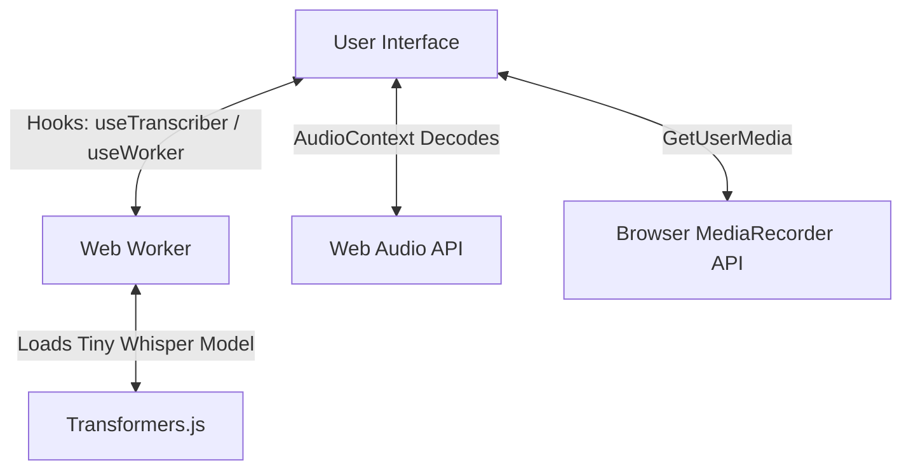

# How to Build the Whisper Audio Transcription App from Scratch

This guide walks you through building a high-performance, in-browser audio transcription application using **Next.js**, **Tailwind CSS**, and **Transformers.js** (`@xenova/transformers`). 

To align with modern design standards, we will use **Radix UI** primitives and **Radix Icons** (`@radix-ui/react-icons`) for the interface.

---

## 🏗️ Architecture Overview

The application processes audio locally (client-side) to ensure data privacy and zero server costs. To keep the UI fluid and responsive during heavy machine learning computation, we offload transcription to a **Web Worker**.



---

## 🛠️ Step 1: Project Setup & Dependencies

1. **Initialize a new Next.js project with TypeScript and Tailwind CSS**:
   ```bash
   npx -y create-next-app@latest whisper-app --typescript --tailwind --app --src-dir=false
   cd whisper-app
   ```

2. **Install the dependencies**:
   ```bash
   npm install @xenova/transformers axios clsx tailwind-merge class-variance-authority tailwindcss-animate
   npm install @radix-ui/react-dialog @radix-ui/react-label @radix-ui/react-progress @radix-ui/react-slot @radix-ui/react-icons
   ```

---

## 📂 Step 2: Establish Constants and Types

Create `lib/types.ts` to define the transcriber interface:
```typescript
// lib/types.ts
export interface TranscriberData {
  text: string
}

export interface Transcriber {
  onInputChange: () => void
  isProcessing: boolean
  isModelLoading: boolean
  modelLoadingProgress: number
  start: (audioData: AudioBuffer | undefined) => void
  output?: TranscriberData
}
```

Create `lib/constants.ts` to store default values (like sample rates and fallback audio URLs):
```typescript
// lib/constants.ts
const constants = {
  SAMPLING_RATE: 16000,
  DEFAULT_AUDIO_URL: 'https://huggingface.co/datasets/Xenova/transformers.js-docs/resolve/main/ted_60_16k.wav',
  DEFAULT_MODEL: 'Xenova/whisper-tiny.en',
}
export default constants
```

---

## 🧵 Step 3: Set Up the Web Worker (`lib/worker.js`)

Web Workers must be loaded as static resources or bundled carefully. In Next.js, we instantiate them using `new URL(...)`.

Create `lib/worker.js` to run the Whisper model in a separate thread:
```javascript
// lib/worker.js
import { pipeline, env } from '@xenova/transformers'

env.allowLocalModels = false

class AutomaticSpeechRecognitionPipelineFactory {
  static task = 'automatic-speech-recognition'
  static model = 'Xenova/whisper-tiny.en'
  static instance = null

  static async getInstance(progress_callback = null) {
    if (this.instance === null) {
      this.instance = pipeline(this.task, this.model, { progress_callback })
    }
    return this.instance
  }
}

self.addEventListener('message', async event => {
  const { audio } = event.data
  const transcript = await transcribe(audio)
  if (transcript === null) return

  self.postMessage({
    status: 'complete',
    task: 'automatic-speech-recognition',
    data: transcript
  })
})

const transcribe = async audio => {
  const p = AutomaticSpeechRecognitionPipelineFactory
  const transcriber = await p.getInstance(data => self.postMessage(data))

  const options = {
    chunk_length_s: 30,
    stride_length_s: 5
  }

  return await transcriber(audio, options).catch(error => {
    self.postMessage({
      status: 'error',
      task: 'automatic-speech-recognition',
      data: error
    })
    return null
  })
}
```

---

## 🪝 Step 4: Create Hooks for State Management

We need two hooks: one to safely instantiate the Web Worker and another to handle state mapping between the component and worker.

### 1. `hooks/useWorker.ts`
Ensures the worker runs only on the client side:
```typescript
// hooks/useWorker.ts
import { useState } from 'react'

export interface MessageEventHandler {
  (event: MessageEvent): void
}

export function useWorker(messageEventHandler: MessageEventHandler): Worker | null {
  const [worker] = useState(() => createWorker(messageEventHandler))
  return worker
}

function createWorker(messageEventHandler: MessageEventHandler): Worker | null {
  if (typeof window === 'undefined') return null

  const worker = new Worker(new URL('../lib/worker.js', import.meta.url), {
    type: 'module'
  })
  worker.addEventListener('message', messageEventHandler)
  return worker
}
```

### 2. `hooks/useTranscriber.ts`
Manages the audio transformation (stereo-to-mono downsampling) and orchestrates worker communication:
```typescript
// hooks/useTranscriber.ts
import { useCallback, useMemo, useState } from 'react'
import { useWorker } from '@/hooks/useWorker'
import { Transcriber, TranscriberData } from '@/lib/types'

export function useTranscriber(): Transcriber {
  const [output, setOutput] = useState<TranscriberData | undefined>()
  const [isProcessing, setIsProcessing] = useState(false)
  const [isModelLoading, setIsModelLoading] = useState(false)
  const [modelLoadingProgress, setModelLoadingProgress] = useState(0)

  const webWorker = useWorker(event => {
    const message = event.data

    switch (message.status) {
      case 'progress':
        setModelLoadingProgress(message.progress)
        break
      case 'initiate':
        setIsModelLoading(true)
        break
      case 'ready':
        setIsModelLoading(false)
        break
      case 'complete':
        setOutput(message.data)
        setIsProcessing(false)
        break
      case 'error':
        setIsProcessing(false)
        break
    }
  })

  const onInputChange = useCallback(() => {
    setOutput(undefined)
  }, [])

  const start = useCallback(
    async (audioData: AudioBuffer | undefined) => {
      if (!audioData) return
      setOutput(undefined)
      setIsProcessing(true)

      let audio: Float32Array
      if (audioData.numberOfChannels === 2) {
        // Downsample stereo to mono
        const SCALING_FACTOR = Math.sqrt(2)
        const left = audioData.getChannelData(0)
        const right = audioData.getChannelData(1)
        audio = new Float32Array(left.length)
        for (let i = 0; i < audioData.length; ++i) {
          audio[i] = (SCALING_FACTOR * (left[i] + right[i])) / 2
        }
      } else {
        audio = audioData.getChannelData(0)
      }

      webWorker?.postMessage({ audio })
    },
    [webWorker]
  )

  return useMemo(() => ({
    onInputChange,
    isProcessing,
    isModelLoading,
    modelLoadingProgress,
    start,
    output
  }), [onInputChange, isProcessing, isModelLoading, modelLoadingProgress, start, output])
}
```

---

## 🎨 Step 5: Radix Icons Integrations

To build the UI entirely with Radix Icons, we map the requirements as follows:

| Lucide Icon | Radix Icon Equivalent |
| :--- | :--- |
| `Play` | `PlayIcon` |
| `Pause` | `PauseIcon` |
| `Square` (Stop) | `StopIcon` |
| `Download` | `DownloadIcon` |
| `Link` | `Link2Icon` |
| `Loader` (Spinning) | `ReloadIcon` |
| `Mic` | *Custom SVG* (Not natively in Radix) |

### 🎙️ Custom Radix-style Microphone Icon
Define a custom Microphone icon matching Radix's 15x15 design template to ensure uniformity:

```tsx
// components/icons/MicrophoneIcon.tsx
import * as React from 'react'

export function MicrophoneIcon(props: React.SVGProps<SVGSVGElement>) {
  return (
    <svg
      width="15"
      height="15"
      viewBox="0 0 15 15"
      fill="none"
      xmlns="http://www.w3.org/2000/svg"
      {...props}
    >
      <path
        d="M7.5 1.5C6.39543 1.5 5.5 2.39543 5.5 3.5V7.5C5.5 8.60457 6.39543 9.5 7.5 9.5C8.60457 9.5 9.5 8.60457 9.5 7.5V3.5C9.5 2.39543 8.60457 1.5 7.5 1.5ZM4.5 3.5C4.5 1.84315 5.84315 0.5 7.5 0.5C9.15685 0.5 10.5 1.84315 10.5 3.5V7.5C10.5 9.15685 9.15685 10.5 7.5 10.5C5.84315 10.5 4.5 9.15685 4.5 7.5V3.5ZM3.5 7C3.77614 7 4 7.22386 4 7.5C4 9.433 5.567 11 7.5 11C9.433 11 11 9.433 11 7.5C11 7.22386 11.2239 7 11.5 7C11.7761 7 12 7.22386 12 7.5C12 9.68962 10.4349 11.5135 8.25 11.9373V13.5H9.5C9.77614 13.5 10 13.7239 10 14C10 14.2761 9.77614 14.5 9.5 14.5H5.5C5.22386 14.5 5 14.2761 5 14C5 13.7239 5.22386 13.5 5.5 13.5H6.75V11.9373C4.56513 11.5135 3 9.68962 3 7.5C3 7.22386 3.22386 7 3.5 7Z"
        fill="currentColor"
        fillRule="evenodd"
        clipRule="evenodd"
      />
    </svg>
  )
}
```

---

## 📦 Step 6: Create Key Components

### 🎙️ 1. Audio Recorder (`components/audio-recorder.tsx`)
Captures user microphone input using `MediaRecorder` API and decodes it.

```tsx
// components/audio-recorder.tsx
'use client'

import { useState, useRef, useEffect } from 'react'
import { Button } from '@/components/ui/button'
import { MicrophoneIcon } from '@/components/icons/MicrophoneIcon'
import { PlayIcon, PauseIcon, StopIcon } from '@radix-ui/react-icons'

interface AudioRecorderProps {
  onRecordingComplete: (blob: Blob) => void
}

export function AudioRecorder({ onRecordingComplete }: AudioRecorderProps) {
  const [isRecording, setIsRecording] = useState(false)
  const [isPaused, setIsPaused] = useState(false)
  const [recordingTime, setRecordingTime] = useState(0)

  const mediaRecorderRef = useRef<MediaRecorder | null>(null)
  const audioChunksRef = useRef<Blob[]>([])
  const streamRef = useRef<MediaStream | null>(null)
  const timerRef = useRef<NodeJS.Timeout | null>(null)

  const startRecording = async () => {
    try {
      const stream = await navigator.mediaDevices.getUserMedia({ audio: true })
      streamRef.current = stream

      const mediaRecorder = new MediaRecorder(stream)
      mediaRecorderRef.current = mediaRecorder
      audioChunksRef.current = []

      mediaRecorder.ondataavailable = event => {
        if (event.data.size > 0) audioChunksRef.current.push(event.data)
      }

      mediaRecorder.onstop = () => {
        const audioBlob = new Blob(audioChunksRef.current, { type: 'audio/wav' })
        onRecordingComplete(audioBlob)
      }

      mediaRecorder.start()
      setIsRecording(true)
      setIsPaused(false)
      setRecordingTime(0)

      timerRef.current = setInterval(() => setRecordingTime(p => p + 1), 1000)
    } catch (e) {
      console.error(e)
    }
  }

  const pauseRecording = () => {
    if (!mediaRecorderRef.current || !isRecording) return
    if (isPaused) {
      mediaRecorderRef.current.resume()
      setIsPaused(false)
      timerRef.current = setInterval(() => setRecordingTime(p => p + 1), 1000)
    } else {
      mediaRecorderRef.current.pause()
      setIsPaused(true)
      if (timerRef.current) clearInterval(timerRef.current)
    }
  }

  const stopRecording = () => {
    if (!mediaRecorderRef.current || !isRecording) return
    mediaRecorderRef.current.stop()
    setIsRecording(false)
    setIsPaused(false)
    if (timerRef.current) clearInterval(timerRef.current)
    streamRef.current?.getTracks().forEach(t => t.stop())
  }

  useEffect(() => {
    return () => {
      if (timerRef.current) clearInterval(timerRef.current)
      streamRef.current?.getTracks().forEach(t => t.stop())
    }
  }, [])

  return (
    <div className='flex w-full flex-col items-center space-y-4'>
      <div className='flex items-center justify-center space-x-2 font-mono text-lg'>
        <span>{Math.floor(recordingTime / 60).toString().padStart(2, '0')}:{(recordingTime % 60).toString().padStart(2, '0')}</span>
        {isRecording && !isPaused && <span className='h-2.5 w-2.5 animate-pulse rounded-full bg-red-600' />}
      </div>

      <div className='flex space-x-4'>
        {!isRecording ? (
          <Button onClick={startRecording} size='icon'>
            <MicrophoneIcon className='h-4 w-4' />
          </Button>
        ) : (
          <>
            <Button onClick={pauseRecording} size='icon' variant='outline'>
              {isPaused ? <PlayIcon className='h-4 w-4' /> : <PauseIcon className='h-4 w-4' />}
            </Button>
            <Button onClick={stopRecording} size='icon' variant='destructive'>
              <StopIcon className='h-4 w-4' />
            </Button>
          </>
        )}
      </div>
    </div>
  )
}
```

---

### 📂 2. URL Dialog Component (`components/url-dialog.tsx`)
Lets users pull audio files from external URL sources. Built using `@radix-ui/react-dialog` and styled with Tailwind.

```tsx
// components/url-dialog.tsx
'use client'

import { useState } from 'react'
import constants from '@/lib/constants'
import { Dialog, DialogContent, DialogDescription, DialogFooter, DialogHeader, DialogTitle, DialogTrigger } from '@/components/ui/dialog'
import { Input } from '@/components/ui/input'
import { Label } from '@/components/ui/label'
import { Button } from '@/components/ui/button'
import { DownloadIcon, Link2Icon } from '@radix-ui/react-icons'

export function UrlDialog({ onUrlChange }: { onUrlChange: (url: string) => void }) {
  const [isOpen, setIsOpen] = useState(false)
  const [url, setUrl] = useState(constants.DEFAULT_AUDIO_URL)

  const onLoad = () => {
    if (url) {
      onUrlChange(url)
      setIsOpen(false)
    }
  }

  return (
    <Dialog open={isOpen} onOpenChange={setIsOpen}>
      <DialogTrigger asChild>
        <Button variant='outline'>
          <Link2Icon className='mr-2 h-4 w-4' />
          <span>From URL</span>
        </Button>
      </DialogTrigger>
      <DialogContent>
        <DialogHeader>
          <DialogTitle>Fetch Audio from URL</DialogTitle>
          <DialogDescription>Enter the path of the audio file to decode.</DialogDescription>
        </DialogHeader>
        <div className='flex items-center space-x-2'>
          <Label htmlFor='link' className='sr-only'>URL</Label>
          <Input id='link' value={url} onChange={e => setUrl(e.target.value)} />
          <Button type='button' size='sm' onClick={onLoad}>
            <DownloadIcon className='mr-2 h-4 w-4' /> Load
          </Button>
        </div>
      </DialogContent>
    </Dialog>
  )
}
```

---

### 🎛️ 3. Audio Manager Component (`components/audio-manager.tsx`)
Tracks source configurations, downloads remote URLs, decodes the binaries into standard `AudioBuffer` containers, and schedules jobs.

```tsx
// components/audio-manager.tsx
'use client'

import axios from 'axios'
import { useState, useEffect, useCallback } from 'react'
import { Transcriber } from '@/lib/types'
import { Button } from '@/components/ui/button'
import { UrlDialog } from '@/components/url-dialog'
import { AudioRecorderDialog } from '@/components/audio-recorder-dialog'
import AudioPlayer from '@/components/audio-player'
import { ReloadIcon } from '@radix-ui/react-icons'

export default function AudioManager({ transcriber }: { transcriber: Transcriber }) {
  const [audioData, setAudioData] = useState<{ buffer: AudioBuffer; url: string; mimeType: string } | undefined>()
  const [url, setUrl] = useState<string | undefined>()

  const reset = () => {
    transcriber.onInputChange()
    setAudioData(undefined)
    setUrl(undefined)
  }

  const decodeAudio = async (arrayBuffer: ArrayBuffer, mimeType: string, objectUrl: string) => {
    const audioCtx = new AudioContext({ sampleRate: 16000 })
    const decoded = await audioCtx.decodeAudioData(arrayBuffer)
    setAudioData({ buffer: decoded, url: objectUrl, mimeType })
  }

  const handleRecording = (blob: Blob) => {
    reset()
    const url = URL.createObjectURL(blob)
    const reader = new FileReader()
    reader.onloadend = () => {
      decodeAudio(reader.result as ArrayBuffer, blob.type, url)
    }
    reader.readAsArrayBuffer(blob)
  }

  const downloadAudio = useCallback(async (targetUrl: string, signal: AbortSignal) => {
    try {
      setAudioData(undefined)
      const res = await axios.get(targetUrl, { signal, responseType: 'arraybuffer' })
      const blob = new Blob([res.data], { type: 'audio/*' })
      const blobUrl = URL.createObjectURL(blob)
      decodeAudio(res.data, res.headers['content-type'] || 'audio/wav', blobUrl)
    } catch (e) {
      console.log('Aborted/Failed URL load', e)
    }
  }, [])

  useEffect(() => {
    if (!url) return
    const ctrl = new AbortController()
    downloadAudio(url, ctrl.signal)
    return () => ctrl.abort()
  }, [url, downloadAudio])

  return (
    <div className='w-full max-w-xl rounded-xl border p-6 shadow-sm flex flex-col gap-6'>
      <div className='flex gap-4 justify-between'>
        <UrlDialog onUrlChange={setUrl} />
        <AudioRecorderDialog onLoad={handleRecording} />
      </div>

      {audioData && (
        <>
          <AudioPlayer audioUrl={audioData.url} mimeType={audioData.mimeType} />
          <div className='flex gap-4 justify-between mt-4'>
            <Button onClick={() => transcriber.start(audioData.buffer)}>
              {transcriber.isModelLoading || transcriber.isProcessing ? (
                <>
                  <ReloadIcon className='mr-2 h-4 w-4 animate-spin' />
                  <span>{transcriber.isModelLoading ? 'Loading Model' : 'Transcribing'}</span>
                </>
              ) : (
                <span>Transcribe</span>
              )}
            </Button>
            <Button variant='outline' onClick={reset}>Reset</Button>
          </div>
        </>
      )}
    </div>
  )
}
```

---

### 📄 4. Transcript Viewer (`components/transcript.tsx`)
Renders transcription results and displays placeholder skeletons during transcription.

```tsx
// components/transcript.tsx
import { Transcriber } from '@/lib/types'

export default function Transcript({ transcriber }: { transcriber: Transcriber }) {
  const { output, isProcessing } = transcriber

  return (
    <div className='w-full max-w-xl rounded-xl border p-6 shadow-sm'>
      <h2 className='text-xl font-semibold mb-4'>Transcription Output</h2>
      <div className='h-40 overflow-y-auto font-sans text-sm text-foreground/80 leading-relaxed'>
        {isProcessing ? (
          <div className='flex flex-col gap-2.5 animate-pulse'>
            <div className='h-3.5 w-full rounded bg-muted' />
            <div className='h-3.5 w-11/12 rounded bg-muted' />
            <div className='h-3.5 w-10/12 rounded bg-muted' />
          </div>
        ) : output ? (
          <pre className='whitespace-pre-wrap font-sans'>{output.text}</pre>
        ) : (
          <p className='text-muted-foreground italic text-center pt-8'>No audio file loaded or transcribed yet.</p>
        )}
      </div>
    </div>
  )
}
```

---

## 🎨 Step 7: The Layout and Shell Setup

In `app/page.tsx`, we coordinate the model status loader and arrange the component columns:

```tsx
// app/page.tsx
'use client'

import AudioManager from '@/components/audio-manager'
import Transcript from '@/components/transcript'
import { useTranscriber } from '@/hooks/useTranscriber'
import * as Progress from '@radix-ui/react-progress'

export default function Home() {
  const transcriber = useTranscriber()

  return (
    <main className='min-h-screen py-16 flex flex-col items-center justify-center bg-background text-foreground px-4'>
      <div className='max-w-4xl w-full flex flex-col gap-8'>
        <div className='flex flex-col gap-4 sm:flex-row sm:items-center sm:justify-between border-b pb-6'>
          <div>
            <h1 className='text-4xl font-extrabold tracking-tight'>Whisper local AI</h1>
            <p className='text-muted-foreground text-sm mt-1'>Convert audio to text locally using Transformers.js</p>
          </div>
          <div className='flex flex-col items-end gap-1.5 w-60'>
            <div className='flex justify-between w-full text-xs font-semibold text-muted-foreground'>
              <span>{transcriber.isModelLoading ? 'Downloading model' : transcriber.modelLoadingProgress === 100 ? 'Model Ready' : 'Model not loaded'}</span>
              <span>{transcriber.modelLoadingProgress.toFixed()}%</span>
            </div>
            <Progress.Root
              className='relative overflow-hidden bg-muted rounded-full w-full h-2.5'
              value={transcriber.modelLoadingProgress}
            >
              <Progress.Indicator
                className='bg-primary w-full h-full transition-transform duration-500 ease-out'
                style={{ transform: `translateX(-${100 - transcriber.modelLoadingProgress}%)` }}
              />
            </Progress.Root>
          </div>
        </div>

        <div className='grid grid-cols-1 md:grid-cols-2 gap-8'>
          <AudioManager transcriber={transcriber} />
          <Transcript transcriber={transcriber} />
        </div>
      </div>
    </main>
  )
}
```

---

## 🏁 Step 8: Execution and Verification

1. **Verify package versions**:
   Check that `@radix-ui/react-icons` is referenced correctly inside your `package.json`.
2. **Build and Run**:
   ```bash
   npm run dev
   ```
   Open `http://localhost:3000` to test local audio file decoding, voice recordings, and fast on-device automatic speech recognition.
